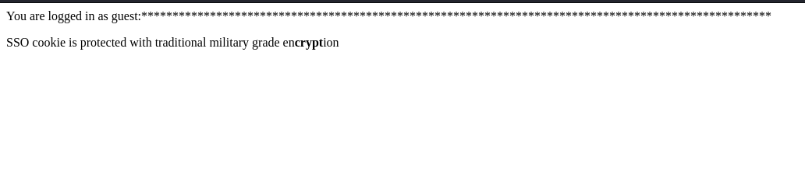
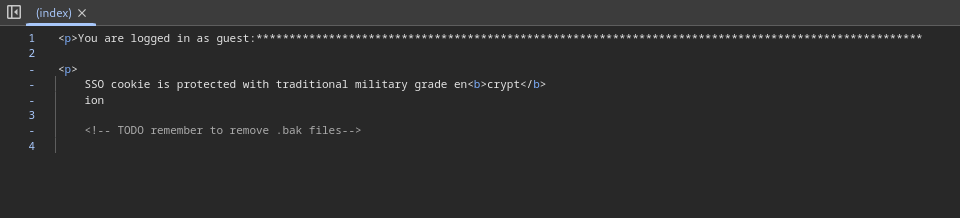

# Ciao bello! This Writeup is still work in progress, come back later for something awesome (parmiggiana di melanzane sold separately)
# Crypto-Failures
## Challenge Description

First exploit the encryption scheme in the simplest possible way, then find the encryption key.

- Question 1: What is the value of the web flag?


- Question 2: What is the encryption key?

<i>You can find the full challenge at the following link: [TryHackme Crypto-Failures](https://tryhackme.com/room/cryptofailures)</i>

## Table of Contents
- Walkthrough
    - Exploring the Application
    - The Backup File
    - Forging Admin Cookie - First Flag
    - Decrypting Encrypted Secret - Second Flag
- Main takeaways

## Walkthrough

### Exploring the Application
It seems like TryHackMe is really into their crypto recently, well then let's jump in amici miei!

The first thing, as always, is to visit the IP address from our browser to gather a sense of wha the application is like. Unlike the last cryptography challenge we went over, this time the website seems to be much more "bare-bone":



Don't let that fool you however, my detective instincts are already starting to itch. In particular, why is "crypt" in "encryption" <b>bold</b>? To investigate, I decided to take a look at the HTML to see if there was anything useful, and sure there was!

```html
<!-- TODO remember to remove .bak files -->
```
<i>Daje</i> that's what we like to see! Before enumerating with ffuf, I wanted to see if the .bak file mentioned was actually the index page in which we are located, and what do you know, it was actually just that!

If you visit ```http://[MACHINE_IP]/index.php.bak``` we get a very interesting file. Probably however the challenge wanted us to find this by enumeration, so I will leave the ffuf command if you wanna do it the "right" way.
```bash
ffuf -w /usr/share/wordlists/seclists/Discovery/Web-CDecrypting Encrypted Secret - Second Flag
<?php
include('config.php');

function generate_cookie($user,$ENC_SECRET_KEY) {
    $SALT=generatesalt(2);
    
    $secure_cookie_string = $user.":".$_SERVER['HTTP_USER_AGENT'].":".$ENC_SECRET_KEY;

    $secure_cookie = make_secure_cookie($secure_cookie_string,$SALT);

    setcookie("secure_cookie",$secure_cookie,time()+3600,'/','',false); 
    setcookie("user","$user",time()+3600,'/','',false);
}

function cryptstring($what,$SALT){

return crypt($what,$SALT);

}


function make_secure_cookie($text,$SALT) {

$secure_cookie='';

foreach ( str_split($text,8) as $el ) {
    $secure_cookie .= cryptstring($el,$SALT);
}

return($secure_cookie);
}


function generatesalt($n) {
$randomString='';
$characters = '0123456789abcdefghijklmnopqrstuvwxyzABCDEFGHIJKLMNOPQRSTUVWXYZ';
for ($i = 0; $i < $n; $i++) {
    $index = rand(0, strlen($characters) - 1);
    $randomString .= $characters[$index];
}
return $randomString;
}


function verify_cookie($ENC_SECRET_KEY){


    $crypted_cookie=$_COOKIE['secure_cookie'];
    $user=$_COOKIE['user'];
    $string=$user.":".$_SERVER['HTTP_USER_AGENT'].":".$ENC_SECRET_KEY;

    $salt=substr($_COOKIE['secure_cookie'],0,2);

    if(make_secure_cookie($string,$salt)===$crypted_cookie) {
        return true;
    } else {
        return false;
    }
}


if ( isset($_COOKIE['secure_cookie']) && isset($_COOKIE['user']))  {

    $user=$_COOKIE['user'];

    if (verify_cookie($ENC_SECRET_KEY)) {
        
    if ($user === "admin") {
   
        echo 'congrats: ******flag here******. Now I want the key.';

            } else {
        
        $length=strlen($_SERVER['HTTP_USER_AGENT']);
        print "<p>You are logged in as " . $user . ":" . str_repeat("*", $length) . "\n";
	    print "<p>SSO cookie is protected with traditional military grade en<b>crypt</b>ion\n";    
    }

} else { 

    print "<p>You are not logged in\n";
   

}

}
  else {

    generate_cookie('guest',$ENC_SECRET_KEY);
    
    header('Location: /');


}
?>
```
This seems pretty scary at first, so let's break down the sections that we care about.

It seems like this website is using a special cookie (namely ```secure_cookie```) to ensure authentication in the website. This cookie is made taking the ```user``` cookie, the HTTP header `USER_AGENT` and an encrypted secret key. 

All of this is encrypted in the `cryptstring()` function using the `crypt()` php method (that's why crypt was bolded in the HTML file!). By default this method uses standard DES, which is a pretty old and vulnerable encryption algorithm. 

In particular, and this is the key to the challenge, DES <b>only</b> encrypts the first 8 characters of a string, hence why in the `make_secure_cookie` function the text is encrypted in 8 characters chunk from the following for loop:
```php
foreach ( str_split($text,8) as $el ) {
    $secure_cookie .= cryptstring($el,$SALT);
}
```
Another very insecure thing about this file is how the salt is generated. This is the result of just 2 characters picked randomly from a set of numbers and letters. The salt can also be seen at the beginning of our cookie, as we can easily discover by the following line in `verify_cookie()`:
```php
$salt=substr($_COOKIE['secure_cookie'],0,2);
```
Knowing all of this information, we can now start break some things!

### Forging Admin Cookie - First Flag
As I said before, the key to this challenge is the fact that DES breaks our ciphertext into chunks of the same length. This pattern can be easily spotted thanks to the salt, take this cookie for example: 
```
YVxrXiItMvl4.YVXAfPSj79DCsYVMOFnVbr4PoIYVp7zS9yqUwPsYVwm7yUPcW6XMYV6jUWQdWxwqsYVn%2Fwry9OoIKsYVS1TOZVTMVIQYV5KB0kA8z2cMYVmBxRMGfPAtEYVfhV8vlgf3qMYVLWgc8OnNTBAYVOtDQQLlcYi.YVaXxTxsR8rg2YVuwQ11nXRn0.YVtHlTRlWDnJkYVdJ2TKN0h.ikYVRfA9fh205ZUYVmDZo%2Fdju%2FT2YV5maG%2FQ8tA0gYV9Mi9FghWBlQ
```
Do you see the pattern here? How about now?
> <u><b>YV</u></b>xrXiItMvl4.<b><u>YV</b></u>XAfPSj79DCs<b><u>YV</b></u>MOFnVbr4PoI<b><u>YV</b></u>p7zS9yqUwPs<b><u>YV</b></u>wm7yUPcW6XM etc...

These 13 character blocks are equivalent to the 8 characters we saw in the for loop a while back. Amici mie, grab your hammers because it is time to forge!

The first thing is to grab a valid guest cookie, I will use Burp Suite for the rest of the challenge, so make sure you know how to use it or use an equivalent tool of your choice. If you are unfamiliar with burp and you wanna follow along, check out this TryHackMe room: [Burp Tutorial](https://tryhackme.com/room/burpsuitebasics). 

Before grabbing the cookie however, we need to do some manipulation to make our life easier. Even before visiting the site, activate the Burp Proxy and change the `USER_AGENT` header to
```
User-Agent: AAAAAAAA
```
The actual content doesn't matter, the important thing is that it is 8 characters long (i.e. a block in DES). After you do this, send the request and observe the cookie you got back. Thanks to the backup file, we know that our decrypted cookie will look something like this:
```
guest:AAAAAAAA:[Encrypted Secret Key]
```
Which means that the first 13 characters of our encrypted cookie will translate to the first 8 characters of that string, `guest:AA`. To forge an admin cookie, all we need to do is replace this initial block with `admin:AA`, we can do this by encrypting it using the following php script:
```php
<?php

function cryptstring($what,$SALT){

    return crypt($what,$SALT);
    
}

echo cryptstring("admin:AA", $SALT)

?>
```
where `$SALT` is the first two characters of your original cookie. If you are lost, take this example cookie:
```
YVxrXiItMvl4.YVXAfPSj79DCsYVMOFnVbr4PoIYVp7zS9yqUwPsYVwm7yUPcW6XMYV6jUWQdWxwqsYVn%2Fwry9OoIKsYVS1TOZVTMVIQYV5KB0kA8z2cMYVmBxRMGfPAtEYVfhV8vlgf3qMYVLWgc8OnNTBAYVOtDQQLlcYi.YVaXxTxsR8rg2YVuwQ11nXRn0.YVtHlTRlWDnJkYVdJ2TKN0h.ikYVRfA9fh205ZUYVmDZo%2Fdju%2FT2YV5maG%2FQ8tA0gYV9Mi9FghWBlQ
```
The first block is
```
YVxrXiItMvl4.
```
which we know is "guest:AA", to make it "admin:AA" all we need to do is replace that block with the output of this code:
```php
<?php

function cryptstring($what,$SALT){

    return crypt($what,$SALT);
    
}

echo cryptstring("admin:AA", "YV")

?>
```
which is:
```
YV82.Eux48iAQ
```
so our final cookie will be
> <u><b>YV82.Eux48iAQ</b></u>YVXAfPSj79DCsYVMOFnVbr4PoIYVp7zS9yqUwPsYVwm7yUPcW6XMYV6jUWQdWxwqsYVn%2Fwry9OoIKsYVS1TOZVTMVIQYV5KB0kA8z2cMYVmBxRMGfPAtEYVfhV8vlgf3qMYVLWgc8OnNTBAYVOtDQQLlcYi.YVaXxTxsR8rg2YVuwQ11nXRn0.YVtHlTRlWDnJkYVdJ2TKN0h.ikYVRfA9fh205ZUYVmDZo%2Fdju%2FT2YV5maG%2FQ8tA0gYV9Mi9FghWBlQ

Now all we need to do is send this cookie (remember to also change the `user` cookie to "admin" and to keep the `User-Agent` header as "AAAAAAAA") and we will be logged in as admin, getting our first flag!

### Decrypting Encrypted Secret - Second Flag
