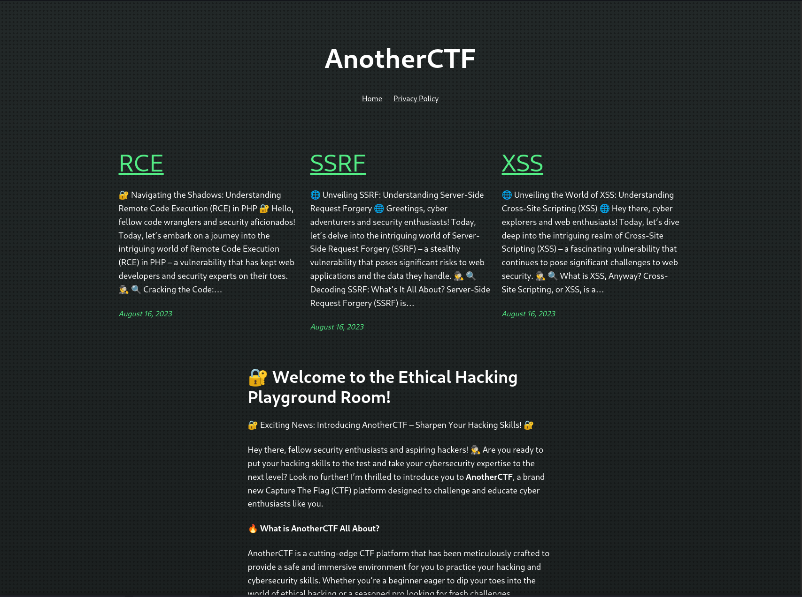
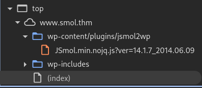
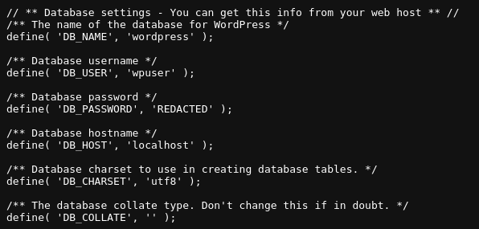

# Smol
## Challenge Description
At the heart of **Smol** is a WordPress website, a common target due to its extensive plugin ecosystem. The machine showcases a publicly known vulnerable plugin, highlighting the risks of neglecting software updates and security patches. Enhancing the learning experience, Smol introduces a backdoored plugin, emphasizing the significance of meticulous code inspection before integrating third-party components.

Quick Tips: Do you know that on computers without GPU like the AttackBox, **John The Ripper** is faster than **Hashcat**?

Questions:
- What is the user flag?
- What is the root flag?

As always, you can find the challenge at the following link: [TryHackMe Smol](https://tryhackme.com/room/smol).

## Table of Contents
- Exploring the Vulnerable Plugins
    - First Vulnerable Plugin
    - Second Vulnerable Plugin
- Gaining a Foothold of the Machine - First Flag
- Escalating our privileges - Second Flag
- Takeaways: to WP or not WP?
    - First Plugin Analysis
    - [Second Plugin Analysis](#second-plugin-analysis)

## Exploring the Vulnerable Plugins
Before we dive in, is it Christmas? It's a bit confusing (and intimidaing) to see so many hints in the description of a **medium** difficulty challenge, but hey I won't complain.

So not even starting the machine, we know already that:
- This is a vulnerable wordpress (wp) web application
- There are two vulnerable plugins:
    - One is outdated
    - The other has a backdoor

Let's go find them out!

To access this website, you'll first need to add the Machine's ip address to your `/etc/hosts` file. On linux, you can run the following command: 
```bash
sudo nano /etc/hosts # or whatever text editor you're comfortable with
```
Then add the following line at the end of the file:
```text
MACHINE_IP smol.thm www.smol.thm
```
Now save (ctrl x + y + ENTER on nano) and we are ready to access the website!



The website itself is not very interesting. There are a few articles with ChatGPT text but nothing too croccante. As with every web challenge, let's see if the server was a bit too chatty and sent us something useful. 

### First Vulnerable Plugin

While there isn't anything that screams "hack me!", a javascript file did catch my eye:


JSmol? Like the name of this challenge? And it's under plugins too?! This must be one of the vulnerabilities described in the challenge, let's see what google has to say.

A quick search reveals that this plugin, JSmol2WP, has a SSRF vulnerability that allows us to read files on the server! You can read more about CVE-2018-20463 at [Nist's website](https://nvd.nist.gov/vuln/detail/CVE-2018-20463), which hopefully still exists [alongside CVEs](https://www.forbes.com/sites/kateoflahertyuk/2025/04/16/cve-program-funding-cut-what-it-means-and-what-to-do-next/) when you read this writeup...

Anyways, we can exploit this using the following Proof of Concept (PoC) provided by [sullo on github](https://github.com/sullo/advisory-archives/blob/master/wordpress-jsmol2wp-CVE-2018-20463-CVE-2018-20462.txt):

```text
http://smol.thm/wp-content/plugins/jsmol2wp/php/jsmol.php
?isform=true
&call=getRawDataFromDatabase
&query=php://filter/resource=../../../../wp-config.php
```
Click enter and you'll have access to the wp-config file!



In case you're unfamiliar with wordpress, wp-config is a php file that contains some pretty sensitive information, such as the username/password for the user database. I redacted the password in the screenshot above to comply with TryHackMe's policy, but if you followed my steps you should see a long, plain-text password instead of REDACTED.

With these credentials, we can shoot a shot at accessing wp-admin, which is the control pannel of wordpress. Entering the username wpuser and that password at `http://smol.thm/wp-admin` gives us access to the behind the scenes of this application.

### Second Vulnerable plugin 
Now that we are on the admin console, let's explore a little bit. On the `Pages` tab, there is an unpublished document called `Webmaster Tasks!!`


Inside, there are a bunch of tasks, but one in particular seems pretty sensitive:
```text
1- [IMPORTANT] Check Backdoors: Verify the SOURCE CODE of "Hello Dolly" plugin as the site's code revision.
```

_Daje_! The second vulnerable plugin is `Hello Dolly`, a staple of wordpress. The plugin itself normally does not have backdoors, so this must be some custom version. Lucky for us JSmol2WP gave us a trick to read any file we want, so with a bit of directory traveral we get:
```text
http://www.smol.thm/wp-content/plugins/jsmol2wp/php/jsmol.php?isform=true&call=getRawDataFromDatabase&query=php://filter/resource=../../hello.php
```

Why that path? Well amico mio here's what we know about the app:
- By default Hello Dolly is stored in a file called hello.php
- This file is located, by default, in wp-content, which is two directories above JSmol2WP
- Hence, we need to climb two directories `../../` to get to the file we need!

The backdoor here is a little less straight forward, as it is a custom one that we can't just google like the last one. If you want an in-depth explanation of how this works, [jump to the end of the writeup for an explenation](#second-plugin-analysis). If you are here just for that sweet flag, keep reading.

The backdoor in `Hello Dolly` allows us to execute arbitrary commands on the host machine. We can do this from wp-admin by appending at the end of the page `?cmd=[COMMAND]`. For example we can do:
```text
http://www.smol.thm/wp-admin/edit.php?cmd=whoami
```
And we should see:
**IMAGE PLACEHOLDER**

Great! Now we are this close to owning the machine, but wait! I know what you're thinking, you wanna go to revshells.com and plug a shell in there. Well, that's what I tried, but there must be some restriction on this backdoor since doing so results into nothing.

We need to get a bit smarter amico mio, after trying some 